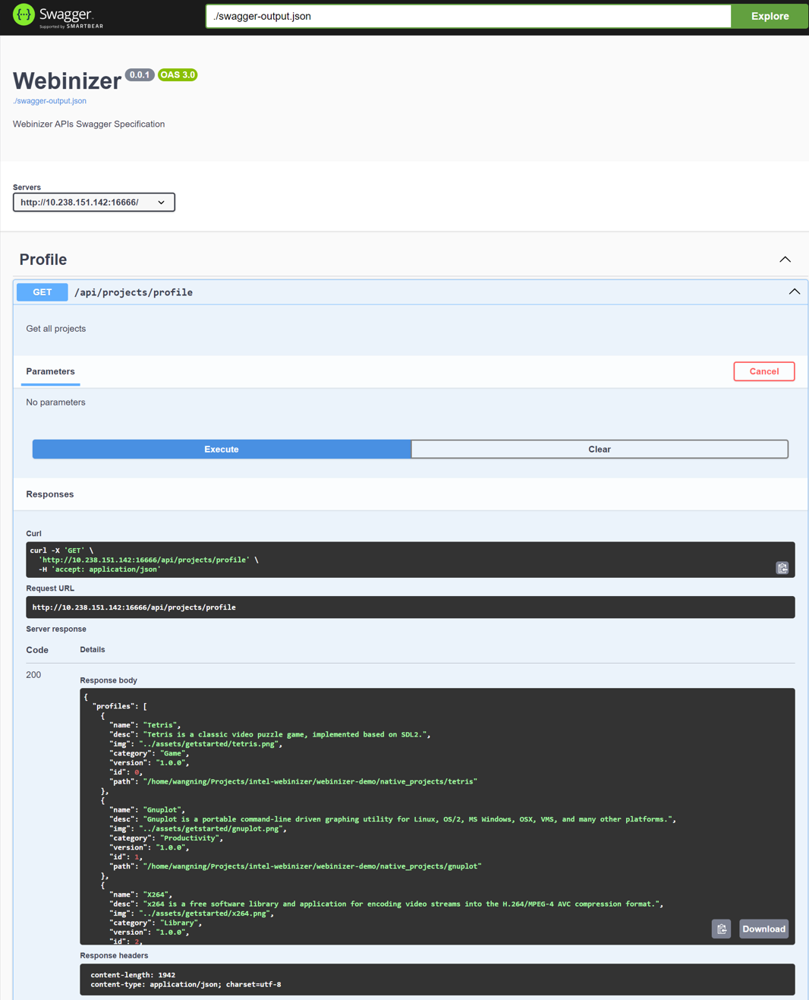

.. _swagger:

Swagger
######################

This section will introduce how to set up swagger specification auto-generation tool ``swagger-autogen``, how to use it to generate spec file and how to visualize and try the requests execution with `Swagger UI
<https://github.com/swagger-api/swagger-ui>`_ tool.

Generation
**********

In ``package.json``, the ``"swagger-autogen": "^2.23.5"`` npm package definition has been added in ``devDependencies``, and the ``"swagger-autogen": "node ./swagger.js"`` script command has been added in ``scripts``. The ``swagger.js`` in root is the key configuration file of the ``swagger-autogen`` module, including the target file, endpoints source file and the schemas definitions. More details are available `here
<https://github.com/swagger-autogen/swagger-autogen#usage-with-optionals>`_.

.. code-block:: shell

   $ npm install # to install the dependencies.
   $ npm run swagger-autogen # to generate the swagger specification file

The ``swagger-output.json`` under the project root directory will be generated after running above commands.

Visualization & Interaction
***************************

In swagger specification file, we can browse the definitions, request parameters, request payload, response payload and their corresponding examples of all apis. Moreover, with the help of swagger UI tool, to visualize and interact with the API's resources without having any of the implementation logic in place.

There are many useful tools available to achieve the effects that mentioned above. Such as, if you want to make it in the `Visual Studio Code`, you can install ``Swagger Viewer`` from the extension market, and execute the ``Preview Swagger`` command from the `swagger specification` file editor to visualize and interact the API's resource as following images shows.

.. image:: ../images/test/swagger-previewer.png

In addition, ``Swagger UI`` is also a great alternative tool. You can run following commands to install it in `Docker mode` <https://github.com/swagger-api/swagger-ui/blob/master/docs/usage/installation.md#docker>`_ and start up the container.

.. code-block:: bash

  # Pull the swagger-ui docker image
  $ docker pull swaggerapi/swagger-ui

  # Start up the container
  # Note. please replace the project repo mapping path
  # `webinizer-demo/webinizer-code/webinizer` with
  # your own webinizer project absolute path
  $ docker run -p 80:8080 \
               -e SWAGGER_JSON=/foo/swagger-output.json \
               -v webinizer-demo/webinizer-code/webinizer:/foo \
               swaggerapi/swagger-ui

Browse to ``http://localhost:80`` to visualize and interact with the API's resource, and following image shows the swagger spec preview results and how to fire request ``GET /api/projects/profile`` to get all project profile list. As for some POST HTTP requests which need required parameters or request payload, you can refer to the examples and follow the schemas to construct.

NOTE
****

If you want to test the APIs related to `registry` like ``POST /api/projects/registry`` and ``POST /api/projects/{root}/publication``, you should setup a npm compatible registry server at first. There are some helpful framework like `verdaccio <https://github.com/verdaccio/verdaccio>`_ to help build a registry quickly.

