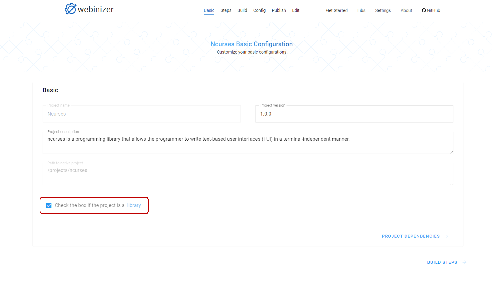
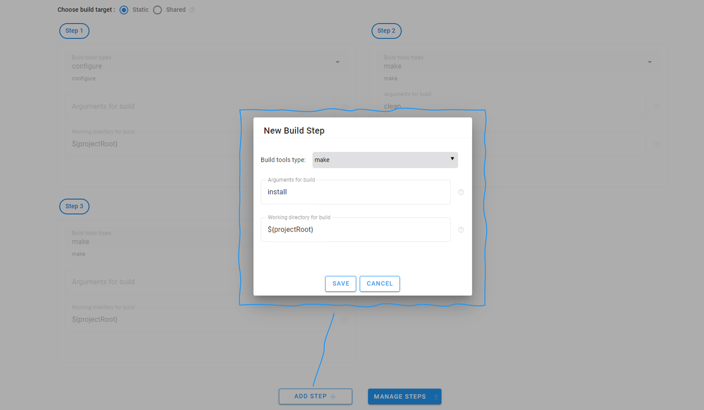
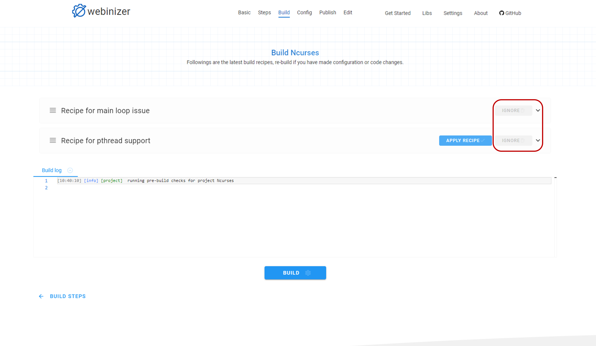
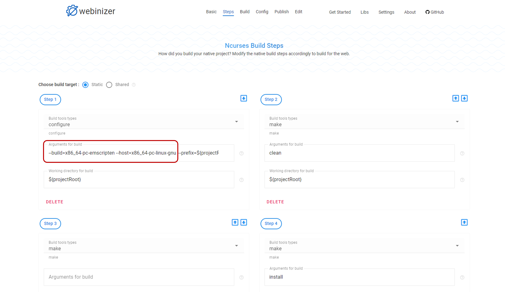
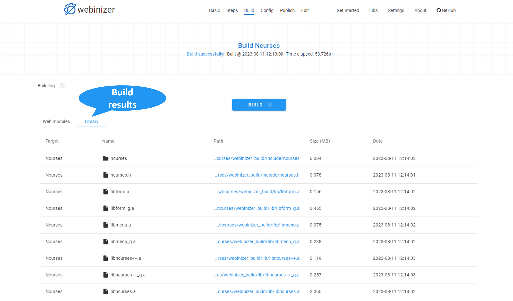
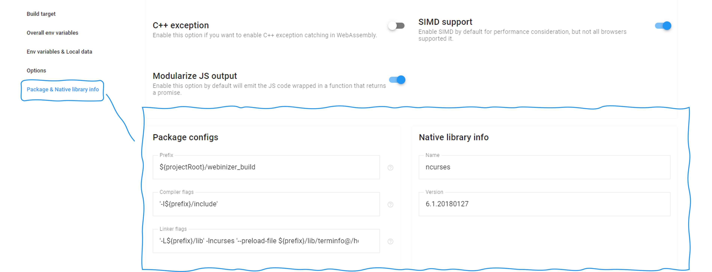

.. _build-a-module:

Build and define a library
##########################

This section will introduce the process of building and defining a library to reuse it in a bigger project using Webinizer.

Build a library
***************

The process of building a library module is similar to that described in the :ref:`build-a-simple-project` section. We'll take the demo project ``Ncurses``, which is a library that allows the programmer to write text-based user interfaces (TUI) in a terminal-independent manner, as an example to go through the processes.

Select the `Ncurses` demo project from ``Get started`` page. Click the checkbox of ``Check the box if the project is a library.`` at the bottom as we are building a library module.
  

Navigate to the `Build steps` page to define build target and build steps. Set build target as ``static`` and accept the recommended build steps from Webinizer. As a library, we'd like to install the library files after a successful build. Click the ``ADD STEP`` button to add another step `make install`. Choose ``Build tools type`` as `make` and add ``Arguments for build`` as `install`, then click the ``SAVE`` button.
  

Navigate to the `Build` page and click the ``BUILD`` button to trigger our first build. We'll be prompted with two recipes generated from Webinizer pre-build checks:
  
* `Recipe for main loop issue`: the `Ncurses` library doesn't have the main loop issue, so we can click the ``IGNORE`` button to dismiss this recipe.
* `Recipe for pthread support`: the detected pthreads usage in the `Ncurses` library are from test files, so we can also click the ``IGNORE`` button to proceed.
  

  
After these recipes are dismissed, we can click the ``BUILD`` button for a second build.

This build will take a longer time so we can check the live build log to understand the build status. After a while, another recipe on ``building intermedium tools with native compiler other than Emscripten`` issue appears. As per the suggestion shown, for `Ncurses` library, we need to enable `cross-platform compiling` and use `gcc` to build these tools to solve this issue. We can add arguments to the `configure` build step to achieve this.

Navigate back to the `Build Steps` page and click the ``MANAGE STEPS`` button to enable editing build steps at first. Then add the arguments ``--build=x86_64-pc-emscripten --host=x86_64-pc-linux-gnu`` to the ``Arguments for build`` field of **Step 1** `configure`. Click the ``FINISH`` button to save the changes.

Navigate to the `Build` page and click the ``BUILD`` button for a third build. A recipe on ``strip issue`` is generated by Webinizer. Similar as the previous action, we can follow the suggestions from the recipe and add the argument ``--disable-stripping`` to **Step 1** `configure` in `Build Steps` page.

Navigate to the `Build` page and click the ``BUILD`` button for a fourth build. A recipe on ``C++ exception`` issue is generated by Webinizer. We can click ``IGNORE`` button on the recipe to dismiss it as the usage of C++ exception catching is detected from demos, which is not related to the core library.

Click the ``BUILD`` button for a fifth build. If everything goes well, after a while, we'll be notified a successful build from Webinizer. We can click the ``Library`` tab from build results section to view the built library files.

Define a library
****************

After building a library successfully, an important additional step required is to define the package configurations and native library information that will be utilized by other projects depending on this library. Click the ``Package & Native library info`` section in the `Config` page will navigate us to the configuration section.

For `Ncurses` library, we'd define the package configurations as below for the ``static`` build target. Note that if multiple targets are defined, we should set the package configurations for each target respectively. Detailed explanations of the package configurations fields are available in :ref:`package-configs-explaination`.
  
* **Prefix**: ``${projectRoot}/webinizer_build``
* **Compiler flags**: ``'-I${prefix}/include'``
* **Linker flags**: ``'-L${prefix}/lib' -lncurses '--preload-file ${prefix}/lib/terminfo@/home/web_user/.terminfo'``

In addition, we also need to set the native library information with `name` and `version`. Below is the example for `Ncurses` library.

* **name**: ``ncurses``
* **version**: ``6.1.20180127``

After all the fields are filled in correctly, we have now completed defining the `Ncurses` library.
