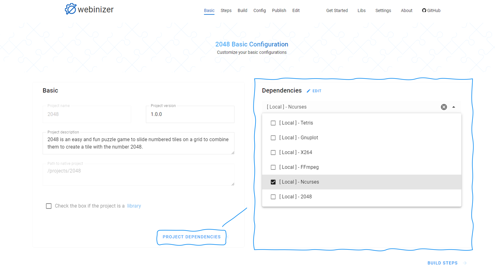
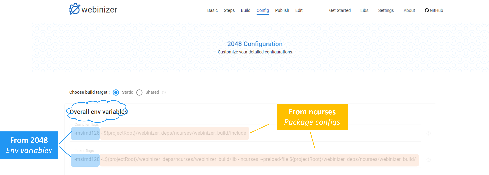
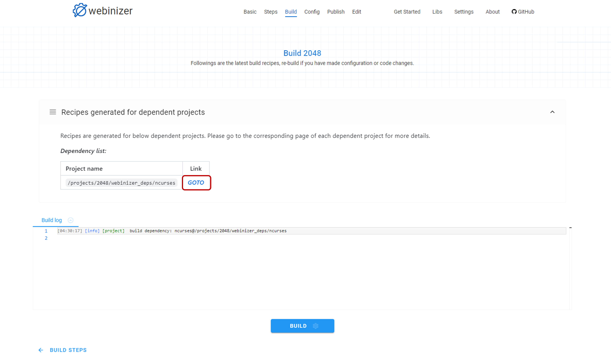
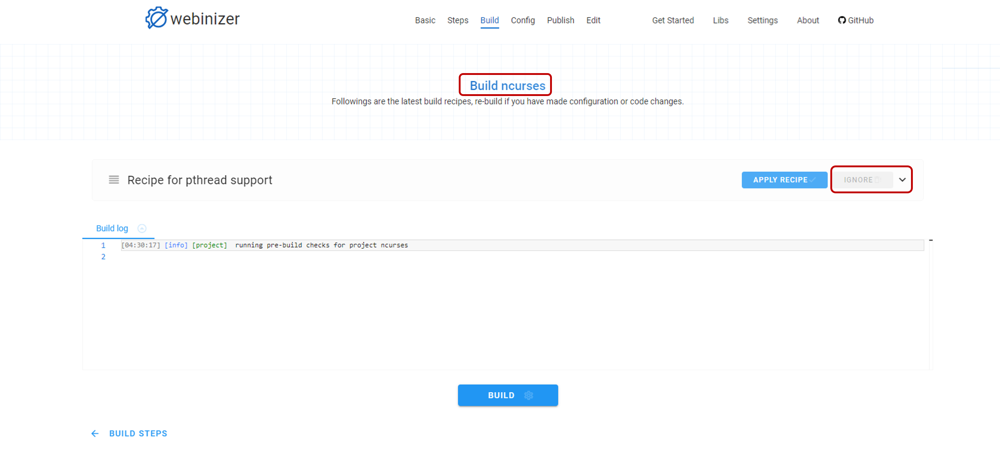
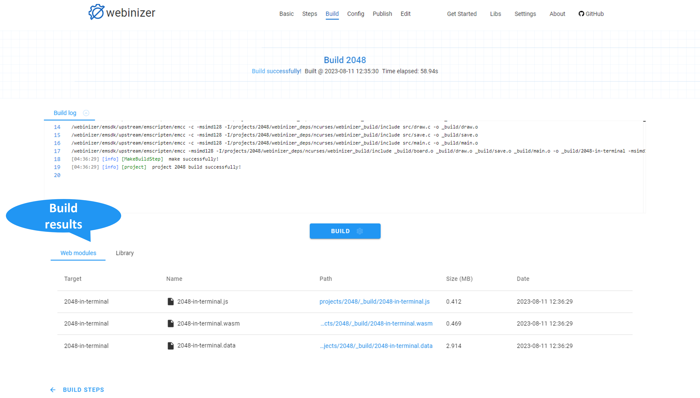
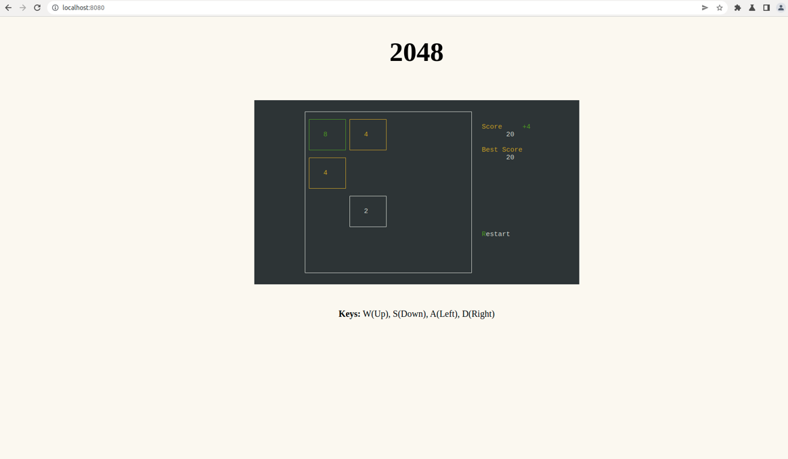

.. _build-a-project-with-dependencies:

Build a project with dependencies
#################################

Webinizer supports adding dependencies to a project and manages the building process with dependencies automatically. This section will introduce how to build a project with dependent libraries using Webinizer.

We'll take the demo project ``2048`` as an example, which is a classical puzzle game that reuses the ``Ncurses`` library we built in section :ref:`build-a-module` as a dependency.

Add a dependency
****************

To add dependencies for a project, navigate to the `Basic Configuration` page, click the ``PROJECT DEPENDENCIES`` button and the `Dependencies` section will be shown.

Click the ``ADD DEPENDENCIES`` button to select the dependent projects we need from the selection list, and then click the ``SAVE`` button to add and confirm. Once the dependencies are successfully added, continue the build process following the instructions in :ref:`build-a-simple-project` section.

If the dependent libraries needed are not available from the selection list :ref:`add-new-project` and build it from the native sources using Webinizer first.

For project `2048`, add ``[Local] - Ncurses`` from the selection list in the `Dependencies` section. It might take a while until the dependency is successfully added.

Configure build with dependencies
*************************************

To configure the build with dependencies, the major difference is the :ref:`config-dependencies` section shown in the `Configuration` page. 

This section allows us to configure the build targets for each dependency and its dependencies, as well as an entry for each dependent project page by clicking the project name. As the target is selected for each dependency, we can observe that the ``Compiler flags`` and ``Linker flags`` from the dependencies' package configurations are automatically appended into the corresponding fields in :ref:`config-overall-env-variables`, which will be utilized by the main project to link all the dependencies together.

For project `2048`, follow the steps below to build with dependencies.

In the `Build steps` page, set the build target as ``static`` and accept the recommended build steps from Webinizer.

In the `Configuration` page, tweak the configurations for build as below.

* In the :ref:`config-options` section, set ``Disable`` to options ``Infinite main loop`` and ``Modularize JS output`` as we are building the demo to run in a worker thread, so the main thread blocking issue from infinite main loop doesn't exist and we can leave the JavaScript glue code to run in a global scope in a worker thread.

* In the :ref:`config-dependencies` section, select the build target for dependency project ``Ncurses`` as ``static`` as we'd build the whole application using static linking.

Navigate to the `Build` page and click the ``BUILD`` button to trigger the first build. Webinizer would build the dependency `Ncurses` first and then link it against the main project `2048`. After a while, a recipe appears, showing there are recipes generated for dependent projects. We can expand the recipe, follow the suggestion and click the ``GOTO`` link to navigate to a new tab for the dependent project.

A recipe on ``C++ exception`` issue is generated by Webinizer for the `Ncurses` project. Click the ``IGNORE`` button to dismiss it as the usage of C++ exception is detected from demos, which are not related to the core library.

Then switch back to the **main project tab** and click the ``BUILD`` button for a second build.

If everything goes well, we'll be notified a successful build from Webinizer, as well as the statistics of the WebAssembly modules generated from the build.

To load the WebAssembly modules in the browser, we can run the ``run.sh`` script provided in the ``demos/2048`` folder. The demo is based on Web Worker, so we need to launch the browser with `SharedArrayBuffer` feature enabled at first:

.. code-block:: bash

  path/to/your/chrome --enable-features=SharedArrayBuffer

Then we can enjoy the game in the browser!

