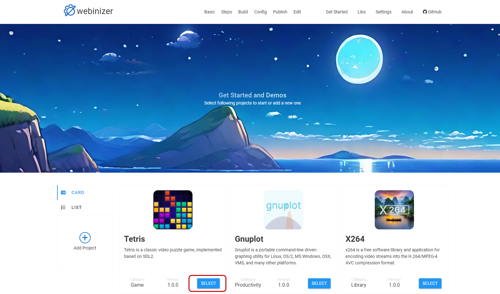
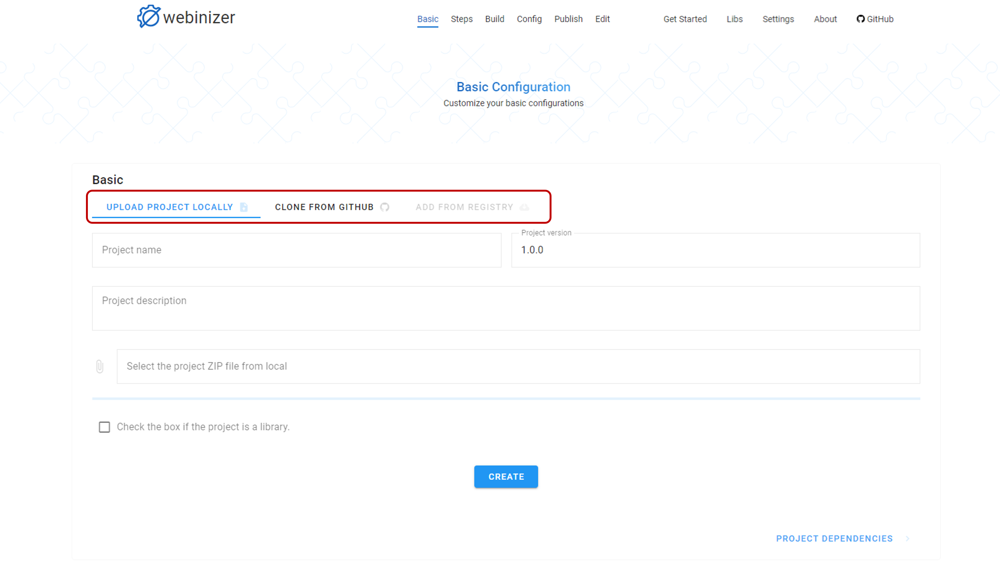
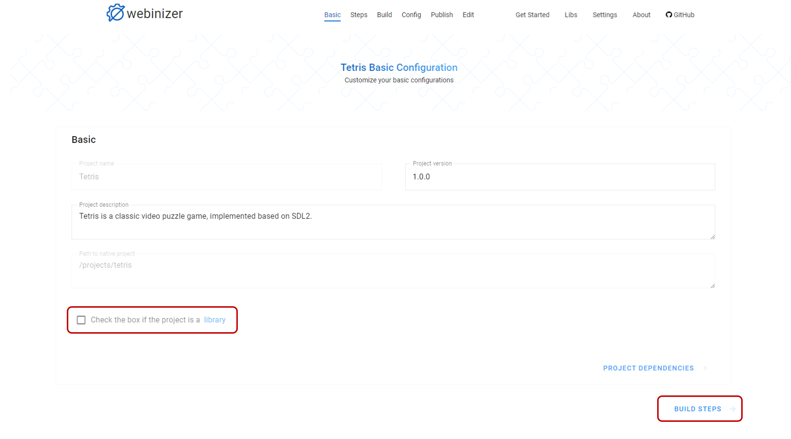
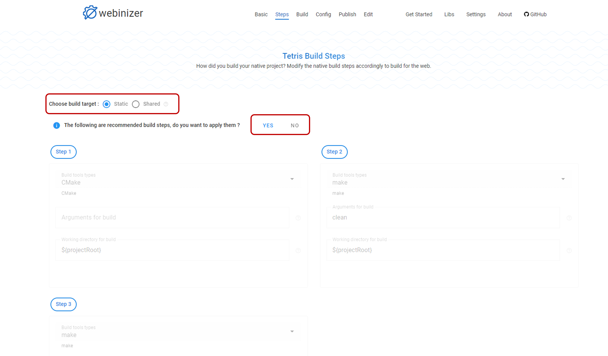
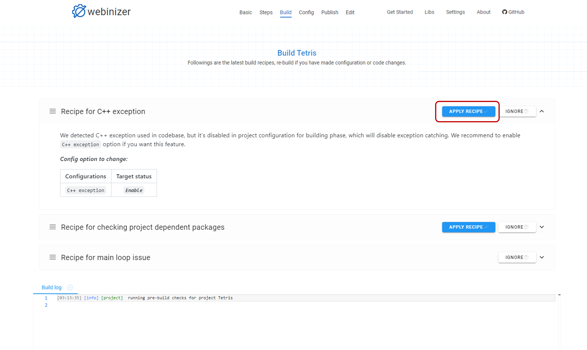
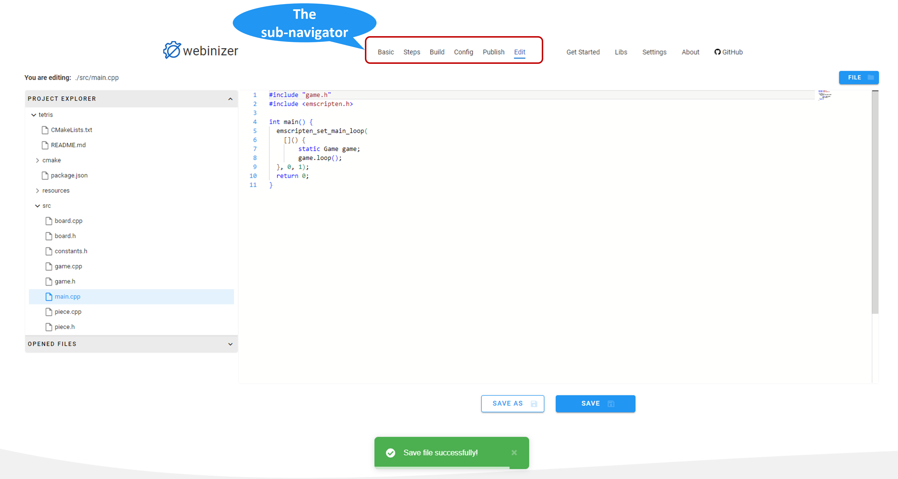
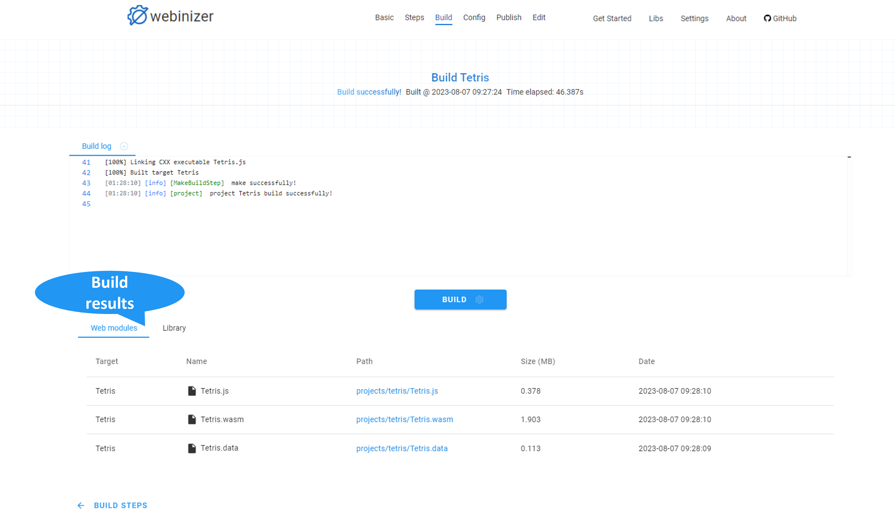
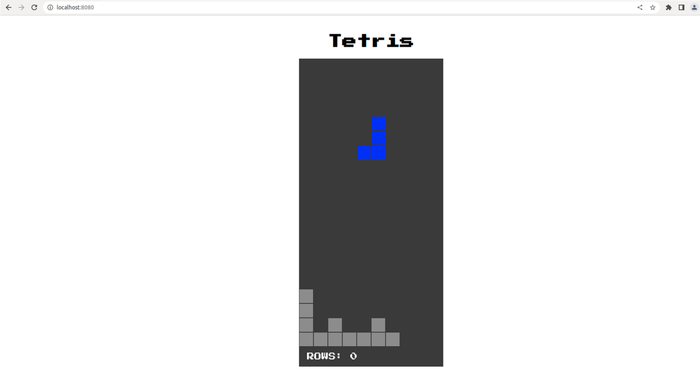
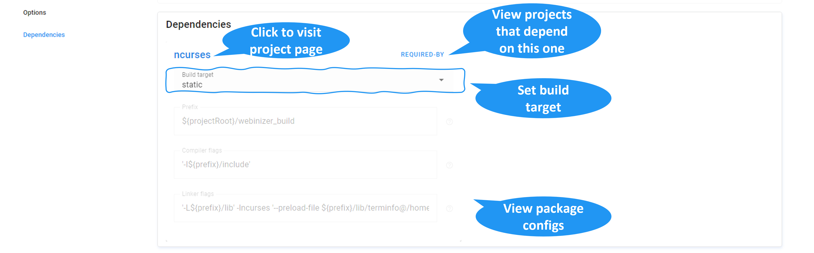

.. _build-a-simple-project:

Build a simple project
######################

This section will walk through the process of building a simple project using Webinizer.

We'll use the demo project ``Tetris`` as an example, and when all the build processes are successfully completed, we can play this classical game in the browser. Let's get started!

.. _get-started:

Get started
***********

The `Get started` page is the entry for all Webinizer projects. We can either click the ``SELECT`` button on the project profile we'd like to choose from the demo projects, or the ``Add Project`` button to :ref:`add-new-project`.

For the ``Tetris`` project, we can click the ``SELECT`` button from the project profile, and it'll navigate us to the :ref:`basic-configuration` page.

.. _add-new-project:

Add a new Webinizer project
***************************
Webinizer supports three ways of adding a new project.

* **Upload project locally**. This method allow us to upload a project ``.zip`` package to Webinizer.
* **Clone from GitHub**. This method allows us to pull the project sources and setup locally by providing a git repository address.
* **Add from registry**. This method allows us to add a project from a Webinizer-supported registry by providing the package `name` and `version`.

Click the ``Add Project`` button from `Get Started` page will navigate us to an empty :ref:`basic-configuration` page, where we can select the method we'd like to add a project from by clicking on different tabs. After all the required project information is provided, click the ``CREATE`` button to let Webinizer setup the project locally.

.. _basic-configuration:

Basic configuration
*******************

The `Basic configuration` page presents basic information about the project, including project `name`, `version`, `description` and `location`. If your project is a library, you should also click the checkbox at the bottom to inform Webinizer.

``Tetris`` is an application project rather than a library, so we can leave the checkbox unchecked and click the ``BUILD STEPS ->`` button to navigate us to the `Build steps` page.

.. _build-steps:

Build steps
***********

The `Build steps` page describes how we can build a project step by step.

First, set a build target for our build. Currenly Webinizer only supports two build targets:

* ``static``: Select the static build target if you want to build your project with static linking. All dependent libraries will be built into Wasm archive files (.a), and then linked to the main project to get a standalone Wasm module with no external dependencies.
* ``shared``: Select the shared build target if you want to build your project with dynamic linking. All dependent libraries will be built into Wasm binary files (.wasm/.so) as side modules (using flag -sSIDE_MODULE), whose exports will be dynamically imported into the context of main project's Wasm module (using flag -sMAIN_MODULE) by JavaScript glue code.

More details for static and dynamic linking are available `here
<https://emscripten.org/docs/compiling/Dynamic-Linking.html>`_.

Once the build target is set, Webinizer will prompt us with recommended build steps based on the ``native`` build systems detected in the project. Each build step has three properties:

* **Build tools type**: specifies what's the build tool to use for a ``native`` build. Below are the five built-in build tools type Webinizer supports. We can extend the build tools type supported by refering to the section :ref:`develop-an-extension`.

  .. list-table:: Build tools type
     :widths: 25 50
     :header-rows: 1

     * - Build tools type
       - Description
     * - CMake
       - Build the native project with a ``cmake`` command.
     * - configure
       - Build the native project using a ``configure`` script.
     * - make
       - Build the native project with a ``make`` command.
     * - cc
       - Build the native project with a ``gcc`` command.
     * - native commands
       - Run other native commands, such as ``cp``, ``ls``, etc.

* **Arguments for build**: specifies the arguments appended to the build command.
* **Working directory for build**: specifies the working directory to execute the build command.

We can either click the ``YES`` button to accept the recommendations from Webinizer, or click the ``NO`` and ``ADD STEP`` button to add the build steps one by one ourselves. Once the build steps are set, we can click ``MANAGE STEPS`` button to enable modifications on build steps properties and change the orders of build steps, and then click ``FINISH`` button to save the changes.

For the ``Tetris`` project, set the build target as ``static``, and accept the recommended build steps from Webinizer. Click ``BUILD`` button and it'll navigate us to the `Build` page.

.. _build-page:

Build
*****

The `Build` page is the entry to trigger the build process and presents the build recipes, logs and results.

For the ``Tetris`` project, click the ``BUILD`` button to trigger a build. After a while, Webinizer will prompt us with three build recipes.

Build recipes are applicable actions or suggestions provided by Webinizer if any errors occurred during the build process. Clicking on each recipe will show us the detailed contents of the recipe, including description of the issues detected and possible solutions provided by Webinizer.

If the recipe has an ``APPLY RECIPE`` button at the upper-right corner, it means that this is an applicable action and click it will apply this recipe automatically and trigger a new build afterwards. If the ``IGNORE`` button is clicked, then this recipe will be dismissed and not shown again. Here we'd like to accept the recipe from Webinizer on the ``C++ exception`` issue detected, so we click the ``APPLY RECIPE`` button to proceed.

After a second build, only two recipes are presented. We'd also want to accept the recipe from Webinizer on the ``project dependent packages`` issue detected, so we click the ``APPLY RECIPE`` button to continue as well.

After a third build, only one recipe is left, which is about the ``main loop issue``. Expanding the recipe will display the details and suggestions from Webinizer. This is not an auto-applicable action and requires manual efforts on modifying the source code. Webinizer provides a simple :ref:`edit-page` for viewing and editing the project files. Click the ``Edit`` button from the `sub-navigator` and we'll be directed to the `Editor` page.

* Select the file ``src -> main.cpp`` from the ``Project Explorer`` sidebar and modify the code as below based on the suggestion.

  .. code-block:: cpp

    // main.cpp
    #include "game.h"
    #include <emscripten.h>

    int main() {
      emscripten_set_main_loop(
         {
            static Game game;
            game.loop();
        }, 0, 1);
      return 0;
    }

* Click the ``SAVE`` button to save the changes.
* Click the ``Build`` button from the `sub-navigator` to route us back to the `Build` page to trigger another build.

Note that we can always navigate across different pages using the `sub-navigator` to check the build steps, recipes, logs, configurations, and code editor.

If everything goes well, we'll be notified of a successful build from Webinizer, as well as the statistics of the WebAssembly modules generated from the build.

To load the WebAssembly modules in the browser, we can run the ``run.sh`` script provided in the ``demos/tetris`` folder.

.. _build-configuration:

Configuration
*************

The `Configuration` page presents the available configurations from Webinizer to tweak the build. Below are the explanations for each configure section.

.. _config-build-target:

Build target
------------

Currenly Webinizer only supports two build targets:

* ``static``: Select the static build target if you want to build your project with static linking. All dependent libraries will be built into Wasm archive files (.a), and then linked to the main project to get a standalone Wasm module with no external dependencies.
* ``shared``: Select the shared build target if you want to build your project with dynamic linking. All dependent libraries will be built into Wasm binary files (.wasm/.so) as side modules (using flag -sSIDE_MODULE), whose exports will be dynamically imported into the context of main project's Wasm module (using flag -sMAIN_MODULE) by JavaScript glue code.

More details for static and dynamic linking are available `here
<https://emscripten.org/docs/compiling/Dynamic-Linking.html>`_.

.. _config-overall-env-variables:

Overall env variables
---------------------

The `Overall environment variables` section specifies the overall compiler and linker flags for the build. The compiler and linker flags presented in this field are the aggregation of both the project :ref:`config-env-variables` and its :ref:`config-dependencies` (*if any*) flags. These fields are ``read-only`` and used for information display.

.. _config-env-variables:

Env variables
-------------

The `Environment variables` section specifies compiler and linker flags of the project and related fields in tweaking these flags.

.. list-table:: Environment variables
  :widths: 20 40 40
  :header-rows: 1

  * - Environment variables
    - Description
    - Note
  * - Compiler flags
    - The compiler flags used to build the project.
    - Each argument is separated with a whitespace in Webinizer. If we want to add a single argument with whitespaces inside, please use **single quotation marks** (i.e., ``'-s USE_OPTION'``) to mark it as one.
  * - Lnker flags
    - The linker flags used to build the project.
    - Each argument is separated with a whitespace in Webinizer. If we want to add a single argument with whitespaces inside, please use **single quotation marks** (i.e., ``'-s USE_OPTION'``) to mark it as one.
  * - Exported functions
    - The native function names we'd want to keep alive and available to be called from JavaScript.
    - Each function should be separated with a comma. Modify this field will also update related arguments into ``Linker flags``.
  * - Exported runtime methods
    - The additional JavaScript runtime methods provided by Emscripten for better interaction with WebAssembly binary that we'd like to export to the JavaScript glue code.
    - Each function should be separated with a comma. Modify this field will also update related arguments into ``Linker flags``.
  * - Local data files
    - The paths to the local files we'd like to preload to a ``.data`` file, which will be used by WebAssembly module at runtime.
    - By defualt, Webinizer maps these files to the root of a virtual file system (``@/``). We can also map these files to different locations by setting the file path as ``/path/to/local/file@/path/in/virtual/FS``. Modify this field will also update related arguments into ``Linker flags``.

.. _config-options:

Options
-------

The `Options` section specifies available options to adjust the compiler and linker flags of the project defind in the :ref:`config-env-variables` section.

.. list-table:: Options
  :widths: 25 60 15
  :header-rows: 1

  * - Options
    - Description
    - Default value
  * - Infinite main loop
    - Enable this option if the application uses an infinite main loop (i.e., for rendering).
    - Enable
  * - Pthreads
    - Enable this option if the application uses pthreads. Toggle this option will automatically update related arguments in the ``Compiler flags`` and ``Linker flags`` fields.
    - Disable
  * - C++ exception
    - Enable this option if the application uses C++ exception catching and we'd also like to enable this functionality in WebAssembly. Toggle this option will automatically update related arguments in the ``Compiler flags`` and ``Linker flags`` fields. Note that enable this feature might bring slight performance overhead.
    - Disable
  * - SIMD support
    - Enable this option if we need SIMD support for WebAssembly. Toggle this option will automatically update related arguments in the ``Compiler flags`` and ``Linker flags`` fields.
    - Enable
  * - Modularize JS output
    - Enable this option if we want to emit the JavaScript glue code wrapped into a module instead of a global scope. Toggle this option will automatically update related arguments in the ``Linker flags`` field.
    - Enable

.. _config-dependencies:

Dependencies
------------

The `Dependencies` section specifies build targets and presents corresponding package configurations from **all** dependent libraries. For each dependent library, we can change the build target here, but the corresponding configurations are ``read-only``. If we want to change these configurations, we can navigate to the project page of the dependent library by clicking the library name and conduct changes there. Below are the explanations for the package configuration fields of a dependent library.

.. _package-configs-explaination:

.. list-table:: Package configurations
  :widths: 25 50
  :header-rows: 1

  * - Package configurations fields
    - Description
  * - Prefix
    - The install prefix of the library. This field will be referenced as ``${prefix}`` by below ``Compiler flags`` and ``Linker flags`` fields to identify the path to search for related library files.
  * - Compiler flags
    - The compiler flags that will be acquired by the main project depending on this library to search for the header files (i.e., the ``-I`` options).
  * - Linker flags
    - The linker flags that will be acquired by the main project depending on this library to search for and identify the library files (i.e., the ``-L``, ``-l`` options).

.. _edit-page:

Editor
******

Webinizer provides a simple editor for viewing and editing the project files. It supports basic syntax highlighting of the file content, editing an existing file and creating a new file.

To open a file, we can either select a file from the `Project Explore` sidebar, or click the button ``FILE -> OPEN FILE`` in the upper-right corner and enter a file location directly.

To save a file, we can click the ``SAVE`` button to save any changes to the current opened file or the ``SAVE AS`` button with a given file location to create a new file. We can also click the button ``FILE -> NEW FILE`` in the upper-right corner to create an empty file in the editor and save the content with a specific location by clicking the ``SAVE AS`` button.
